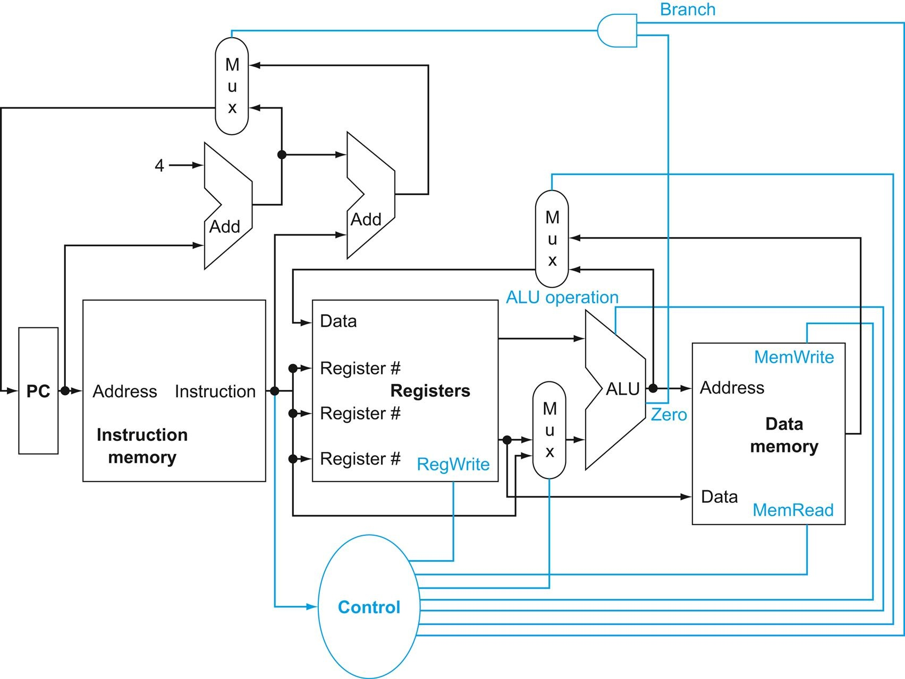
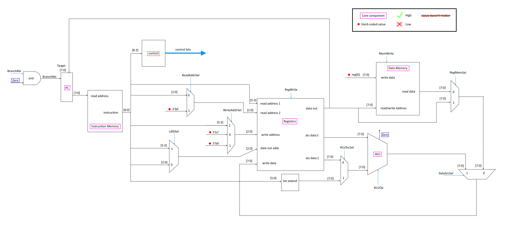
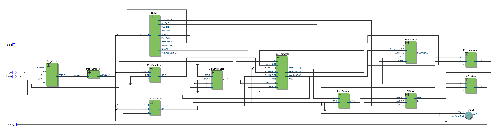

# CSE141L: Custom CPU <!-- omit from toc -->

This project is my completed lab assignment for UCSD's Introduction to Computer
Architecture course. Over the course of 11 weeks, I designed a custom CPU
architecture, instruction set and compiler that implements a [Linear Feedback
Shift Register](https://tinyurl.com/yy6ct385) (LFSR) encryption and decryption
algorithm.

## Contents <!-- omit from toc -->

- [Tools and Code](#tools-and-code)
- [Design](#design)
- [Instructions](#instructions)
    - [set x y](#set-x-y)
    - [lsw 0 y](#lsw-0-y)
    - [lsw x 0](#lsw-x-0)
    - [bne x y](#bne-x-y)
    - [xor x y](#xor-x-y)
    - [add x](#add-x)
    - [par x y](#par-x-y)
    - [errflg x](#errflg-x)
    - [lsor x y](#lsor-x-y)
- [Programs 1-3](#programs-1-3)
- [Code Documentation](#code-documentation)
    - [START](#start)
    - [lsw 0 0](#lsw-0-0)
    - [#!# VAR EXTRA](#-var-extra)
    - [\<-- VAR](#---var)
    - [--\> VAR](#---var-1)

## Tools and Code

The CPU has was, tested and verified all in software. The CPU code is written
in [SystemVerilog](https://tinyurl.com/233xn2vv), which is a hardware
description and verification language that can be used to model, design,
simulate, test and implement electronic systems. I used
[Quartus](https://tinyurl.com/2c3h9wee) to verify and simulate, and
[ModelSim](https://tinyurl.com/3hfuzku6) to test and debug.

With only SystemVerilog, I would have to write the binary commands by hand.
This would be a nightmare to read, test and debug so I created a
[compiler](./compiler/compiler.py) in Python  to convert [human-readable
code](./compiler/program1.txt) to [assembly](./compiler/assembly_code1.txt),
and then to [binary](./src/machine_code1.txt).

## Design

The MIPS CPU architecture was our guiding example while learning how a CPU is
organized and designed. By the end of the course we understood very well how
each piece of the CPU worked to complete complex tasks. This was my starting
point for designing my CPU.

**Basic MIPS architecture**:[^1]



To better understand how I should design the CPU and the LFSR encryption and
decryption algorithm I outlined the project sudo code and implemented pieces
that I didn't quite understand enough in Python. The Python
[emulator](./emulator/emulator.py) isn't complete but it was enough to help me
piece together the SystemVerilog as I went. By the time I got to the
decryption, I just needed the sudo code.

The biggest constraint in designing this CPU is the 9 bit instruction size. The
number of instructions and registers need to be balanced so that all of the
operations can be performed effectively. I decided to use an
[Accumulator](https://tinyurl.com/357f65v5) to store intermediate results from
the ALU instead of using direct assignment.

This single instruction requires 12 bits. 3 for each address (`sum`, `a` and
`b`) and 3 for the operation (`+`).

```py
sum = a + b
```

These two statements do the same thing, but only require 9 bits and the
Accumulator.

```py
Accumulator = a + b
sum = Accumulator
```

So each instruction requires more steps to be completed, but requires less bits
since the Accumulator register is hardwired.

Registers are directly addressed, but Data Memory and the Program Counter use
indirect addressing. To be able to do forward and backwards jumps from
branching, the Program Counter accepts signed ([two's
complement](https://tinyurl.com/bdwt5kr4)) values.

After going over my emulator code, I estimated that 8 instructions and 8
registers would be enough. In the end, I needed to squeeze in an extra
instruction, do a lot of register hot potato, and use Data Memory from time
to time to make it all work.

**My CPU diagram**:



**Quartus generated diagram**:



## Instructions

`register[0]` is the Accumulator (Acc) register.

### set x y

Sets register `x` equal to register `y`.

`register[x] = register[y]`

- [CPU Path Diagram](./doc/SET.png)

**Constraints**:

- `0 <= x <= 7`
- `0 <= y <= 7`

### lsw 0 y

Stores `register[6]` into Data Memory at the address in `register[7]`.

`DataMem[register[y]] = register[6]`

- [CPU Path Diagram](./doc/SW.png)

**Constraints**:

- `0 <= y <= 7`

### lsw x 0

Loads `register[7]` with value from Data Memory at the address in
`register[x]`.

`register[7] = DataMem[register[x]]`

- [CPU Path Diagram](./doc/LW.png)

**Constraints**:

- `0 <= x <= 7`

### bne x y

Adds (signed) `register[y]` to Program Counter if `register[x]` is not equal to
the Accumulator.

```py
if Acc != register[x], then PC += register[y]
```

- [CPU Path Diagram](./doc/BNE.png)

**Constraints**:

- `0 <= x <= 7`
- `0 <= y <= 7`
- `-128 <= register[y] <= 127`

### xor x y

XORs the 7 LSBs of `register[x]` and `register[y]`, prepends a zero and
stores the value in the Accumulator.

`Acc = {1'b0, (register[x][6:0] ^ register[y][6:0])}`

- [CPU Path Diagram](./doc/XOR.png)

**Constraints**:

- `0 <= x <= 7`
- `0 <= y <= 7`

### add x

Adds `x` to the Accumulator.

`Acc = Acc + x`

- [CPU Path Diagram](./doc/ADD.png)

**Constraints**:

- `0 <= x <= 63`

### par x y

Bitwise ANDs `register[x]` and `register[y]`, reduction XORs that value,
prepends 7 zeros, and stores that value in the Accumulator.

`Acc = {7'b0, (^(register[x] & register[y]))}`

- [CPU Path Diagram](./doc/PAR.png)

**Constraints**:

- `0 <= x <= 7`
- `0 <= y <= 7`

### errflg x

Reduction XORs the 7 LSBs of `register[x]`, replaces the MSB of `register[x]`
and stores that in the Accumulator.

`Acc = {^register[x][6:0], register[x][6:0]}`

- [CPU Path Diagram](./doc/ERRFLG.png)

**Constraints**:

- `0 <= x <= 7`

### lsor x y

Left shifts 7 LSBs of `register[x]`, prepends a zero and bitwise ORs that with
7 LSBs of `register[y]`.

`Acc = {1'b0, ((register[x][6:0] << 1) | register[y][6:0])}`

- [CPU Path Diagram](./doc/LSOR.png)

**Constraints**:

- `0 <= x <= 7`
- `0 <= y <= 7`

## Programs 1-3

This CPU has been designed to run three programs.
[Program1](./compiler/program1.txt) is a LFSR encrypter.
[Program2](./compiler/program2.txt) is a LFSR decrypter. Last,
[Program3](./compiler/program3.txt) is a LFSR decrypter with parity bit error
detection. The class was given test benches with preloaded values to run on our
CPUs. So I could test Program 3 even without writing a program to encrypt with
a parity bit.

## Code Documentation

Anything that isn't an instruction isn't compiled and the compiler does no
error checking.

### START

Indicated the start of the code. This made parsing the program file easier
since I put a lot of notes at the beginning of the file.

### lsw 0 0

Instruction that ends the program.

### #!# VAR EXTRA

Sets the bounds for the jumps. `VAR` must be a unique name and every opening
bound must be closed with the same name. `EXTRA` is ignored text, but useful
for documentation.

```CPU
#!# LOOP

...

#!# LOOP END
```

### <-- VAR

Counts the number of instructions between the matching jump bounds (`#!# VAR`)
and then makes this value negative. Before this is run, the Accumulator needs
to be set to zero so that the jump value is accurate. Then, this value needs to
be stored into a register and used as the second argument in the corresponding
loop `bne` instruction.

```CPU
#!# LOOP1

... # bne jumps here

xor 3 3
# Acc = 0

<-- add LOOP1
# Acc = negative number of instructions for LOOP1

set 2 0
# register[2] = Acc

...

bne 3 2
# if Acc != reg[3] then PC += reg[2]

#!# LOOP1 END
```

### --> VAR

Counts the number of instructions between the matching jump bounds (`#!# VAR`).
Before this is run, the Accumulator needs to be set to zero so that the jump
value is accurate. Then, this value needs to be stored into a register and used
as the second argument in the corresponding loop `bne` instruction.

```CPU
xor 3 3
# Acc = 0

--> add LOOP2
# Acc = number of instructions for LOOP2

set 2 0
# register[2] = Acc

#!# LOOP2

bne 6 2
# if Acc != reg[6] then PC += reg[2]

... # instructions to be jumped over

#!# LOOP2 END

... # bne jumps here
```

[^1]: Patterson, David A., and John L. Hennessy. Computer Organization and
    Design MIPS Edition the Hardware. Morgan Kaufmann, 2020, Section 4.1.
